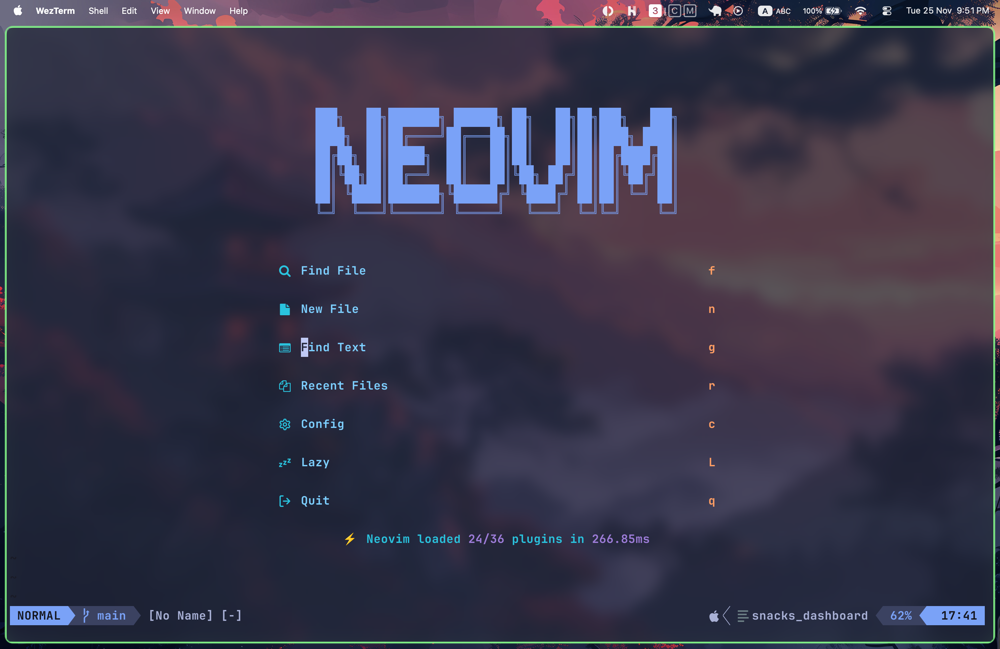
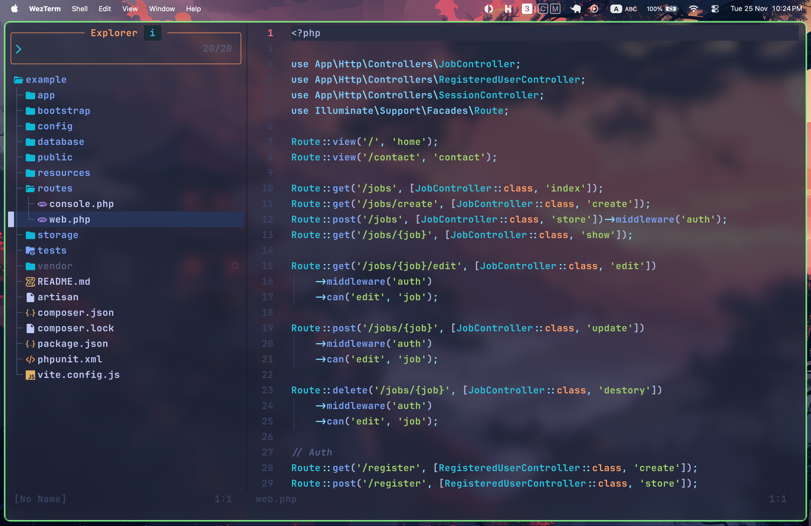

#  Adan's Dev Environment setup

## Terminal 
For the last couple of years I used iTerm2 as my main terminal.
After experimenting and researching more modern terminals, I’ve now switched to [WezTerm](https://wezterm.org/) as my primary.

## Neovim setup
- Neovim >= 0.11.4
- [folke/lazy.nvim](https://github.com/folke/lazy.nvim) - plugin manager
- [blink.cmp](https://github.com/saghen/blink.cmp) -  auto competion
- [snack.nvim](https://github.com/folke/snacks.nvim) - file explorer
- [laravel](https://github.com/adibhanna/laravel.nvim) -  Laravel development
- [lazygit](https://github.com/kdheepak/lazygit.nvim) - git actions
- [lualine](https://github.com/nvim-lualine/lualine.nvim) 
- [tiny-inline-diagnositc](https://github.com/rachartier/tiny-inline-diagnostic.nvim) - display a beautiful diagnostic messages
- Colorschemas 
    - [tokyonight]('https://github.com/folke/tokyonight.nvim')
    - [catppuccin](https://github.com/catppuccin/nvim)
- Theme Switcher 
    I use a custom helper for switching themes easily:
    - `nvim/lua/utils/theme-switcher.lua`

## Window Manager
- [Aerospace](https://github.com/nikitabobko/AeroSpace)

## References & Inspiration
- Parts of this setup were inspired by the open-source community. Special thanks to:
 - https://github.com/josean-dev/dev-environment-files

